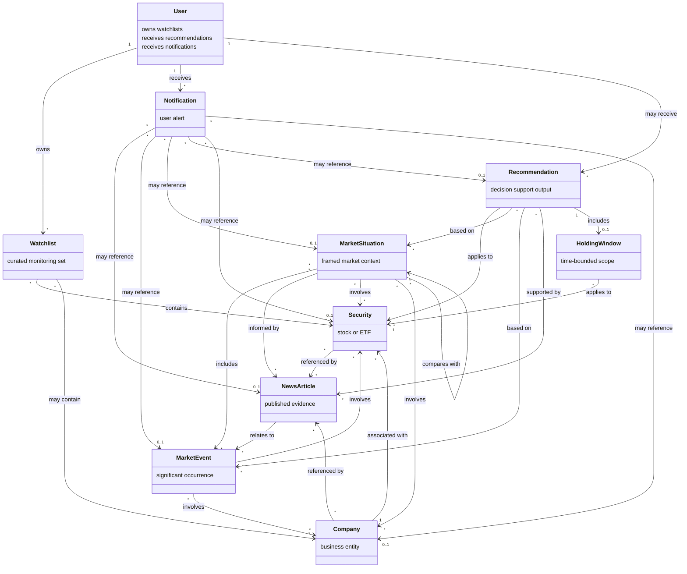

# Architecture — Domain Model

This document defines the core domain objects of the **AI Market Research Platform**. It describes what each object represents in the system and how objects relate conceptually.

It does **not** prescribe implementation details such as storage, APIs, frameworks, or programming languages.

---

## Company

**Purpose:** Represent a real-world business entity that the platform may research, monitor, or reference.

**Description:** A company is an organization whose activity, performance, and public presence are relevant to market research. It provides identity and context for related securities, news coverage, and market situations.

**Relationships:**
- May issue or be associated with one or more **Securities**
- May be referenced by **News Articles**
- May be involved in **Market Events** and **Market Situations**
- May appear on a **Watchlist**

---

## Security (Stock or ETF)

**Purpose:** Represent a tradable financial instrument that the platform monitors and analyzes.

**Description:** A security is a stock or ETF that can be tracked over time. It is the primary object around which market activity, comparisons, recommendations, and holding context are organized.

**Relationships:**
- A stock is associated with a **Company**; an ETF may relate to multiple underlying companies or holdings at a conceptual level
- May be referenced by **News Articles**
- May be involved in **Market Events** and **Market Situations**
- May be the subject of a **Recommendation**
- May have an associated **Holding Window**
- May appear on a **Watchlist**

---

## News Article

**Purpose:** Represent published news content used as evidence in market research.

**Description:** A news article is a discrete piece of reporting or commentary. The platform uses articles to correlate public information with market activity and to support evidence-based analysis.

**Relationships:**
- May reference one or more **Companies** and/or **Securities**
- May describe, precede, or relate to a **Market Event**
- May contribute evidence to a **Market Situation**
- May inform a **Recommendation**
- May trigger a **Notification**

---

## Market Event

**Purpose:** Represent a discrete occurrence that is meaningful to market activity.

**Description:** A market event is something that happened—or is happening—in or around the market that the platform treats as analytically significant. Events provide anchors for correlating news with price or volume activity and for comparing present conditions with the past.

**Relationships:**
- May involve one or more **Companies** and/or **Securities**
- May be linked to one or more **News Articles**
- May contribute to a **Market Situation**
- May inform a **Recommendation**
- May trigger a **Notification**

---

## Market Situation

**Purpose:** Represent a framed market context used for comparison and decision support.

**Description:** A market situation captures a coherent set of conditions—current or historical—against which the platform can compare events, news, and security behavior. Situations enable historical analogy and structured interpretation of what is unfolding.

**Relationships:**
- Involves one or more **Securities** and/or **Companies**
- Is informed by **News Articles** and **Market Events**
- May be compared with other **Market Situations** (for example, current vs. historical)
- May give rise to a **Recommendation**

---

## Recommendation

**Purpose:** Represent evidence-based decision support produced by the platform.

**Description:** A recommendation is a reasoned output that summarizes relevant evidence and presents decision support for a security or related context. It is informational in nature and does not constitute financial advice.

**Relationships:**
- Applies to a **Security** (and may reference related **Companies**)
- Is supported by **News Articles**, **Market Events**, and/or **Market Situations**
- May include a **Holding Window**
- May be associated with a **User**
- May trigger a **Notification**

---

## Holding Window

**Purpose:** Represent a time-bounded period relevant to a recommendation or research thesis.

**Description:** A holding window defines the temporal scope in which a recommendation or analysis is intended to be considered. It expresses duration or date bounds at a conceptual level, not execution instructions.

**Relationships:**
- Belongs to a **Recommendation**
- Applies to a **Security**

---

## Watchlist

**Purpose:** Represent a curated set of entities a user wants to monitor.

**Description:** A watchlist is a user-owned collection of securities and/or companies under active observation. It focuses monitoring, research, and alerts on what matters to that user.

**Relationships:**
- Owned by a **User**
- Contains one or more **Securities** and/or **Companies**
- May influence which **Notifications** a user receives

---

## User

**Purpose:** Represent a person who interacts with the platform.

**Description:** A user is an individual who configures monitoring preferences, maintains watchlists, and receives research outputs and notifications.

**Relationships:**
- Owns one or more **Watchlists**
- May receive **Recommendations**
- Receives **Notifications**

---

## Notification

**Purpose:** Represent an alert delivered to a user about something the platform has observed or produced.

**Description:** A notification informs a user of a relevant change, finding, or output—such as new evidence, a market event, or a recommendation—so they can review it in context.

**Relationships:**
- Is delivered to a **User**
- May reference a **News Article**, **Market Event**, **Market Situation**, **Recommendation**, **Security**, and/or **Company**
- May be influenced by a user's **Watchlist**

---

## Conceptual Relationships

---

## Notes

- Relationships above are conceptual. Cardinalities describe typical associations, not strict system constraints.
- All research outputs, including recommendations, are educational and informational only and do not constitute financial advice.
